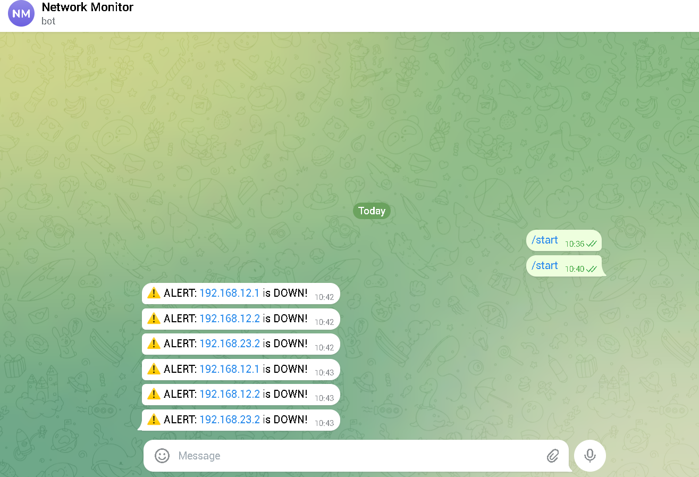

# network-monitor-python
Network monitoring script with Telegram alert

# Network Monitor Python 🔍


Script Python untuk memonitor status device jaringan secara otomatis dan mengirim alert ke Telegram jika ada device yang down.

---

## Fitur

- ✅ Ping sweep ke multiple IP secara otomatis
- ⚠️ Deteksi device DOWN secara real-time
- 📲 Notifikasi alert langsung ke Telegram
- 🔄 Monitoring berjalan terus setiap 30 detik

---

## Demo



---

## Cara Pakai

### 1. Clone repo ini
```bash
git clone git@github.com:zkizen/network-monitor-python.git
cd network-monitor-python
```

### 2. Install dependencies
```bash
pip install requests scapy
```

### 3. Setup Telegram Bot
- Buka Telegram → cari **@BotFather** → `/newbot`
- Copy token yang dikasih BotFather
- Kirim pesan ke bot lo, lalu akses:
  ```
  https://api.telegram.org/bot<TOKEN>/getUpdates
  ```
- Ambil `"id"` dari response — itu Chat ID lo

### 4. Isi konfigurasi di `monitor.py`
```python
TELEGRAM_TOKEN = "token_bot_lo"
TELEGRAM_CHAT_ID = "chat_id_lo"

HOSTS = [
    "192.168.1.1",   # ganti dengan IP device lo
    "8.8.8.8",       # Google DNS
]
```

### 5. Jalankan
```bash
python monitor.py
```

---

## Struktur Project

```
network-monitor-python/
├── monitor.py          ← script utama
├── requirements.txt    ← daftar library
├── screenshots/
│   └── telegram-alert.png
└── README.md
```

---

## Cara Kerja

```
Script jalan → ping tiap IP → 
  jika UP   → print ✅ di terminal
  jika DOWN → print ⚠️ + kirim alert Telegram
→ tunggu 30 detik → ulangi
```

---

## Requirements

```
requests
scapy
```

Simpan juga sebagai `requirements.txt` biar orang lain bisa langsung install:
```bash
pip install -r requirements.txt
```

---

## Yang Dipelajari

- Python `subprocess` untuk eksekusi ping dari script
- HTTP request ke Telegram Bot API dengan `requests`
- Loop monitoring dengan `time.sleep()`
- Dasar network automation dengan Python

---

## Author

**Muhammad Zaki Zein** — [@zkizen](https://github.com/zkizen)  
SMK TKJ Graduate

